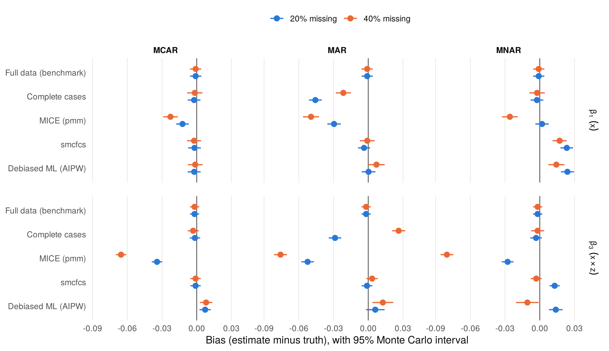

# Multiple imputation versus debiased machine learning for a missing covariate

A simulation study in R. Suppose we have a linear model with an interaction,
`y ~ x + z + x:z`, and some values of `x` are missing. Which method gives you
an unbiased estimate and an honest confidence interval, and how does the
answer change with the missingdata mechanism?

The study compares six approaches across MCAR, MAR and MNAR mechanisms at 20%
and 40% missingness, following the ADEMP framework of Morris, White and
Crowther (2019). The full write-up, with tables and both figures, is in
[report.md](report.md).



## What the pilot shows

Results from a 200-replicate pilot per scenario; [report.md](report.md) has
the tables, Monte Carlo standard errors and coverage plot.

- **Default MICE underestimates the interaction under every mechanism, MCAR
  included.** Bias for the interaction runs from -0.028 to -0.080 and coverage
  drops to 45%. Its imputation model leaves out the x-by-z term.
- **smcfcs is close to unbiased under MCAR and MAR**, with interaction bias
  within 0.003 of zero and coverage between 93.5% and 97%.
- **Complete cases is biased under MAR but unbiased under this MNAR
  mechanism**, where missingness depends on x and z but not on y given them.
  The methods that assume MAR pick up small biases there instead.
- **Debiased ML removes most of the MAR bias without a model for x**
  (interaction bias 0.006 to 0.013, coverage 92% to 95.5%). Its standard error
  is about 1.7 to 1.8 times that of smcfcs, and it needed two safeguards to stay
  stable at n = 1000.

## Design

| | |
|---|---|
| **Data** | $Z \sim N(0,1)$; $X = 0.5Z + \sqrt{0.75}E$; $Y = X + Z + 0.5XZ + U$; $n = 1000$ |
| **Missing data** | $X$ only. MCAR; MAR (depends on $Y$ and $Z$); MNAR (depends on $X$ and $Z$). Missingness probabilities lie between 5% and 80%. |
| **Estimands** | $\beta_1$ (coefficient of $x$) and $\beta_3$ (the $x \times z$ interaction) |
| **Methods** | Full data (benchmark), complete cases, mean imputation, MICE (pmm), smcfcs, cross-fitted debiased ML (AIPW) |
| **Performance** | Bias, empirical and model-based SE, RMSE, 95% CI coverage, each with Monte Carlo SE |

The debiased ML estimator solves an augmented inverse-probability-weighted
estimating equation for regression with a missing covariate (Robins,
Rotnitzky and Zhao 1994). A probability forest estimates the chance that `x`
is observed. An ensemble of a random forest and a quadratic regression
estimates the mean and variance of `x` given `y` and `z`. Cross-fitting keeps
each unit's predictions out of sample, and sandwich standard errors give the
intervals. The code in [R/methods.R](R/methods.R) states the estimating
equation in full.

## Analysis

The analysis done using R 4.6.0 and these packages:

```r
install.packages(c("mice", "smcfcs", "ranger", "future.apply", "ggplot2", "rmarkdown"))
```

Open `mi-vs-dml-missing-data.Rproj` in RStudio, then run these in the
Terminal tab (not the Console):

```sh
Rscript run_simulation.R --quick                 # 5 replicates per scenario, a few minutes
Rscript run_simulation.R                         # full study, 1000 replicates per scenario
Rscript -e "rmarkdown::render('report.Rmd')"     # rebuild report.md and the figures
```

The full study analyses 6,000 datasets at about 5 CPU-seconds each, so plan
on about 9 CPU-hours: about 1.5 hours with 6 parallel workers. The script
uses all but one of your cores; add `--workers=4` to change that. It saves
each scenario as it finishes, so you can stop and restart without losing
work. To run from the Console instead, edit `n_sim` in the `settings` list at
the top of `run_simulation.R` and call `source("run_simulation.R")`.

Replicate *r* of every scenario draws its data from seed `20261008 + r`, and
method *j* runs from seed `20261008 + j * 1e6 + r`. You can rebuild any single
dataset or rerun any single method, and the results do not depend on the
number of workers.

The saved results come from the pilot (`Rscript run_simulation.R --n_sim=200`).
A full run replaces them. Replicates 201 to 1000 also give a fresh check on the
debiased ML estimator, whose final form I settled during the pilot.

## Files

```
R/dgm.R            data-generating mechanism and the three missingness mechanisms
R/methods.R        the six analysis methods and Rubin's rules
R/performance.R    performance measures with Monte Carlo standard errors
run_simulation.R   runs every scenario in parallel and saves the results
report.Rmd         knits to report.md with tables and figures
findings.Rmd       the written interpretation, included in the report
results/           saved estimates (sim_results.rds) and performance.csv
figures/           figures produced by the report
```

## References

- Bartlett JW, Seaman SR, White IR, Carpenter JR (2015). Multiple imputation of covariates by fully conditional specification: accommodating the substantive model. *Statistical Methods in Medical Research* 24(4):462-487.
- Chernozhukov V, Chetverikov D, Demirer M, Duflo E, Hansen C, Newey W, Robins J (2018). Double/debiased machine learning for treatment and structural parameters. *The Econometrics Journal* 21(1):C1-C68.
- Morris TP, White IR, Crowther MJ (2019). Using simulation studies to evaluate statistical methods. *Statistics in Medicine* 38(11):2074-2102.
- Robins JM, Rotnitzky A, Zhao LP (1994). Estimation of regression coefficients when some regressors are not always observed. *Journal of the American Statistical Association* 89(427):846-866.
- Seaman SR, Bartlett JW, White IR (2012). Multiple imputation of missing covariates with non-linear effects and interactions: an evaluation of statistical methods. *BMC Medical Research Methodology* 12:46.

## Author

Dominic Obeng Koranteng, [odk-tech.github.io](https://odk-tech.github.io). MIT licence.
