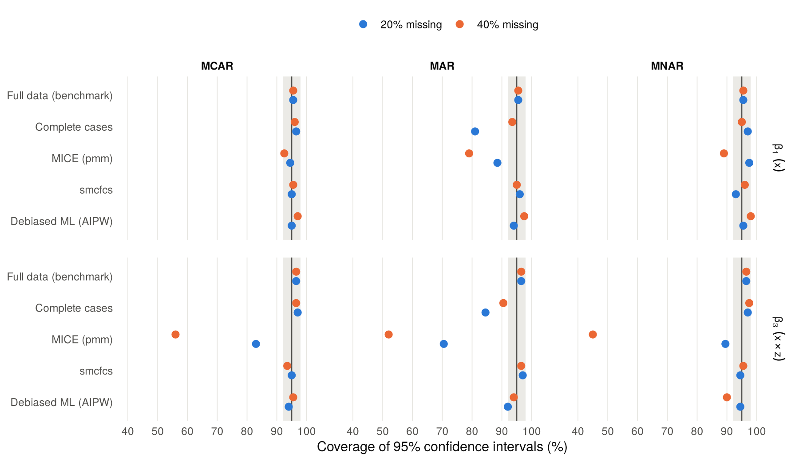

Multiple imputation versus debiased machine learning for a missing
covariate
================
Dominic Obeng Koranteng
08 October 2026

## Aim

When a covariate is missing and the analysis model contains an
interaction, standard multiple imputation can bias the estimates. Two
remedies exist: imputation that respects the analysis model (smcfcs),
and a doubly robust estimator with machine-learned nuisance functions
(debiased machine learning, DML). This study compares both with
complete-case analysis, mean imputation and default MICE under MCAR, MAR
and MNAR mechanisms. The design follows the ADEMP structure of Morris,
White and Crowther (2019).

## Design

**Data-generating mechanism.** Each dataset has *n* = 1000 units.

- $Z \sim N(0, 1)$ and $X = 0.5Z + \sqrt{0.75}\,E$ with
  $E \sim N(0, 1)$, so $X \sim N(0, 1)$ and $\mathrm{corr}(X, Z) = 0.5$.
- $Y = \beta_0 + \beta_1 X + \beta_2 Z + \beta_3 XZ + U$, with
  $U \sim N(0, 1)$ and
  $(\beta_0, \beta_1, \beta_2, \beta_3) = (0, 1, 1, 0.5)$.

$X$ is incomplete; $Y$ and $Z$ are always observed. The probability that
$X$ is missing is

| Mechanism | $P(X \text{ missing})$                           | Depends on          |
|-----------|--------------------------------------------------|---------------------|
| MCAR      | constant                                         | nothing             |
| MAR       | $0.05 + 0.75\,\mathrm{expit}(a_0 + Y + 0.5Z)$    | the outcome and $Z$ |
| MNAR      | $0.05 + 0.75\,\mathrm{expit}(a_0 + 1.5X + 0.5Z)$ | $X$ itself and $Z$  |

Root-finding sets the intercept $a_0$ so that 20% or 40% of $X$ is
missing on average. The floor and ceiling keep every unit’s chance of
being observed at 20% or more, so the positivity condition that
weighting needs holds by design.

**Estimands.** $\beta_1$, the coefficient of $X$, and $\beta_3$, the
$X \times Z$ interaction, in the linear model `y ~ x + z + x:z`.

**Methods.**

| Method             | What it does                                                                                                                                                                                                                                                                                                                                                                                                                                                 |
|--------------------|--------------------------------------------------------------------------------------------------------------------------------------------------------------------------------------------------------------------------------------------------------------------------------------------------------------------------------------------------------------------------------------------------------------------------------------------------------------|
| Full data          | Fits the model before any values are deleted. A benchmark only.                                                                                                                                                                                                                                                                                                                                                                                              |
| Complete cases     | Drops units with missing $X$.                                                                                                                                                                                                                                                                                                                                                                                                                                |
| Mean imputation    | Replaces missing $X$ with the observed mean.                                                                                                                                                                                                                                                                                                                                                                                                                 |
| MICE (pmm)         | `mice` default: predictive mean matching of $X$ on $Y$ and $Z$, then the interaction is formed from the imputed $X$. The imputation model omits the interaction, so it is incompatible with the analysis model. 10 imputations, Rubin’s rules.                                                                                                                                                                                                               |
| smcfcs             | Substantive-model-compatible imputation (Bartlett et al. 2015) with the analysis model supplied. 10 imputations, Rubin’s rules.                                                                                                                                                                                                                                                                                                                              |
| Debiased ML (AIPW) | Augmented inverse-probability-weighted estimating equation for regression with a missing covariate (Robins, Rotnitzky and Zhao 1994), in one-step form. A probability forest estimates $P(R = 1 \mid Y, Z)$, bounded below at 0.05. A two-learner super learner (random forest plus quadratic regression, weights chosen by out-of-sample error) estimates $E[X \mid Y, Z]$ and $\mathrm{Var}(X \mid Y, Z)$. 5-fold cross-fitting; sandwich standard errors. |

**How the DML settings were chosen.** I fixed the learners in
development runs that used different seeds from this study. Forests
alone gave a stable but upward-biased estimator, and adding the
quadratic regression reduced the bias. Two 200-replicate pilots on the
main-study seeds then showed that the AIPW equation can fail. When an
observed unit with an extreme $X$ gets a large weight, the equation’s
matrix comes close to singular. With response probabilities bounded at
0.01, about 7% of datasets at 40% MAR gave inflated standard errors.
Raising the bound to 0.05 (weights at most 20) cut that to 4%, but one
estimate still missed by more than 40. I then switched to the one-step
form, which starts from a plug-in estimate and adds one AIPW correction
step. The one-step form never inverts that matrix and has the same
large-sample behaviour. The results below come from the revised
estimator on those same pilot seeds, so treat the DML rows as
provisional. Replicates 201 to 1000 of the full run give an untouched
check.

I tried a quadratic outcome model (`y ~ x + I(x^2) + z`) first and
dropped it: its estimating equation needs $E[X^4 \mid Y, Z]$, and none
of the learners I tried gave stable estimates at this sample size.

MICE, smcfcs and DML all assume that $X$ is missing at random given $Y$
and $Z$. Complete-case analysis assumes instead that missingness does
not depend on $Y$ once $X$ and $Z$ are known. Under the MNAR mechanism
here that assumption holds, so complete-case analysis should stay
unbiased while the other three should not.

**Performance measures.** Bias, empirical and model-based standard
errors, root mean squared error and the coverage of nominal 95%
confidence intervals, each with its Monte Carlo standard error (MCSE).
Each scenario has 200 replicates.

## Results

<!-- -->

*Figure 1. Bias of each method. Mean imputation is left out because its
bias is far off this scale (between -0.30 and -0.02); Tables 1 and 2
list it.*

<!-- -->

*Figure 2. Coverage of nominal 95% intervals. The grey band shows the
range expected from Monte Carlo error alone if true coverage were 95%.*

**Table 1. Bias (MCSE).**

*Coefficient of x*

| Method                | MCAR 20%       | MAR 20%        | MNAR 20%       | MCAR 40%       | MAR 40%        | MNAR 40%       |
|:----------------------|:---------------|:---------------|:---------------|:---------------|:---------------|:---------------|
| Full data (benchmark) | -0.001 (0.002) | -0.001 (0.002) | -0.001 (0.002) | -0.001 (0.002) | -0.001 (0.002) | -0.001 (0.002) |
| Complete cases        | -0.002 (0.003) | -0.046 (0.003) | -0.002 (0.003) | -0.002 (0.003) | -0.022 (0.003) | -0.002 (0.003) |
| Mean imputation       | -0.063 (0.003) | -0.257 (0.003) | -0.186 (0.003) | -0.116 (0.004) | -0.296 (0.004) | -0.269 (0.004) |
| MICE (pmm)            | -0.012 (0.003) | -0.030 (0.003) | 0.002 (0.003)  | -0.023 (0.003) | -0.049 (0.004) | -0.026 (0.003) |
| smcfcs                | -0.002 (0.003) | -0.004 (0.003) | 0.023 (0.003)  | -0.002 (0.003) | -0.001 (0.003) | 0.017 (0.003)  |
| Debiased ML (AIPW)    | -0.002 (0.003) | 0.000 (0.003)  | 0.024 (0.003)  | -0.001 (0.003) | 0.007 (0.004)  | 0.014 (0.004)  |

*Interaction x:z*

| Method                | MCAR 20%       | MAR 20%        | MNAR 20%       | MCAR 40%       | MAR 40%        | MNAR 40%       |
|:----------------------|:---------------|:---------------|:---------------|:---------------|:---------------|:---------------|
| Full data (benchmark) | -0.002 (0.002) | -0.002 (0.002) | -0.002 (0.002) | -0.002 (0.002) | -0.002 (0.002) | -0.002 (0.002) |
| Complete cases        | -0.002 (0.002) | -0.029 (0.003) | -0.003 (0.003) | -0.003 (0.002) | 0.026 (0.003)  | -0.002 (0.003) |
| Mean imputation       | -0.021 (0.002) | -0.109 (0.003) | -0.087 (0.003) | -0.038 (0.003) | -0.126 (0.003) | -0.133 (0.003) |
| MICE (pmm)            | -0.034 (0.002) | -0.052 (0.003) | -0.028 (0.003) | -0.065 (0.002) | -0.076 (0.003) | -0.080 (0.003) |
| smcfcs                | -0.001 (0.002) | -0.001 (0.002) | 0.013 (0.002)  | -0.001 (0.002) | 0.003 (0.003)  | -0.003 (0.002) |
| Debiased ML (AIPW)    | 0.007 (0.003)  | 0.006 (0.004)  | 0.014 (0.003)  | 0.008 (0.003)  | 0.013 (0.005)  | -0.011 (0.005) |

**Table 2. Coverage of 95% intervals, % (MCSE).**

*Coefficient of x*

| Method                | MCAR 20%   | MAR 20%    | MNAR 20%   | MCAR 40%   | MAR 40%    | MNAR 40%   |
|:----------------------|:-----------|:-----------|:-----------|:-----------|:-----------|:-----------|
| Full data (benchmark) | 95.5 (1.5) | 95.5 (1.5) | 95.5 (1.5) | 95.5 (1.5) | 95.5 (1.5) | 95.5 (1.5) |
| Complete cases        | 96.5 (1.3) | 81.0 (2.8) | 97.0 (1.2) | 96.0 (1.4) | 93.5 (1.7) | 95.0 (1.5) |
| Mean imputation       | 73.0 (3.1) | 0.0 (0.0)  | 5.0 (1.5)  | 43.0 (3.5) | 0.0 (0.0)  | 0.5 (0.5)  |
| MICE (pmm)            | 94.5 (1.6) | 88.5 (2.3) | 97.5 (1.1) | 92.5 (1.9) | 79.0 (2.9) | 89.0 (2.2) |
| smcfcs                | 95.0 (1.5) | 96.0 (1.4) | 93.0 (1.8) | 95.5 (1.5) | 95.0 (1.5) | 96.0 (1.4) |
| Debiased ML (AIPW)    | 95.0 (1.5) | 94.0 (1.7) | 95.5 (1.5) | 97.0 (1.2) | 97.5 (1.1) | 98.0 (1.0) |

*Interaction x:z*

| Method                | MCAR 20%   | MAR 20%    | MNAR 20%   | MCAR 40%   | MAR 40%    | MNAR 40%   |
|:----------------------|:-----------|:-----------|:-----------|:-----------|:-----------|:-----------|
| Full data (benchmark) | 96.5 (1.3) | 96.5 (1.3) | 96.5 (1.3) | 96.5 (1.3) | 96.5 (1.3) | 96.5 (1.3) |
| Complete cases        | 97.0 (1.2) | 84.5 (2.6) | 97.0 (1.2) | 96.5 (1.3) | 90.5 (2.1) | 97.5 (1.1) |
| Mean imputation       | 93.5 (1.7) | 35.5 (3.4) | 50.5 (3.5) | 91.5 (2.0) | 33.0 (3.3) | 24.5 (3.0) |
| MICE (pmm)            | 83.0 (2.7) | 70.5 (3.2) | 89.5 (2.2) | 56.0 (3.5) | 52.0 (3.5) | 45.0 (3.5) |
| smcfcs                | 95.0 (1.5) | 97.0 (1.2) | 94.5 (1.6) | 93.5 (1.7) | 96.5 (1.3) | 95.5 (1.5) |
| Debiased ML (AIPW)    | 94.0 (1.7) | 92.0 (1.9) | 94.5 (1.6) | 95.5 (1.5) | 94.0 (1.7) | 90.0 (2.1) |

**Table 3. Empirical SE / model-based SE / RMSE for the interaction
x:z.**

| Method                | MCAR 20%              | MAR 20%               | MNAR 20%              | MCAR 40%              | MAR 40%               | MNAR 40%              |
|:----------------------|:----------------------|:----------------------|:----------------------|:----------------------|:----------------------|:----------------------|
| Full data (benchmark) | 0.029 / 0.029 / 0.029 | 0.029 / 0.029 / 0.029 | 0.029 / 0.029 / 0.029 | 0.029 / 0.029 / 0.029 | 0.029 / 0.029 / 0.029 | 0.029 / 0.029 / 0.029 |
| Complete cases        | 0.032 / 0.032 / 0.032 | 0.039 / 0.037 / 0.048 | 0.036 / 0.036 / 0.036 | 0.034 / 0.037 / 0.034 | 0.041 / 0.040 / 0.049 | 0.041 / 0.041 / 0.041 |
| Mean imputation       | 0.032 / 0.035 / 0.038 | 0.043 / 0.048 / 0.117 | 0.040 / 0.045 / 0.095 | 0.036 / 0.044 / 0.053 | 0.048 / 0.054 / 0.134 | 0.047 / 0.053 / 0.141 |
| MICE (pmm)            | 0.032 / 0.033 / 0.047 | 0.039 / 0.036 / 0.065 | 0.036 / 0.036 / 0.046 | 0.033 / 0.036 / 0.073 | 0.040 / 0.038 / 0.086 | 0.040 / 0.038 / 0.090 |
| smcfcs                | 0.032 / 0.031 / 0.032 | 0.034 / 0.034 / 0.034 | 0.032 / 0.034 / 0.034 | 0.033 / 0.033 / 0.033 | 0.036 / 0.036 / 0.036 | 0.034 / 0.036 / 0.034 |
| Debiased ML (AIPW)    | 0.035 / 0.035 / 0.036 | 0.058 / 0.061 / 0.058 | 0.042 / 0.043 / 0.045 | 0.038 / 0.040 / 0.039 | 0.065 / 0.073 / 0.066 | 0.071 / 0.085 / 0.071 |

Median computing time per dataset: MICE 0.05 s, smcfcs 3.67 s, debiased
ML 1.36 s.

## Findings

**1. Default MICE underestimates the interaction under every mechanism,
including MCAR.** Its bias for $\beta_3$ runs from -0.080 to -0.028, and
interval coverage falls as low as 45.0%. The cause is the imputation
model, which omits the $X \times Z$ term. Imputed values carry no
interaction, so the pooled estimate shrinks toward zero, and more
missing data means more shrinkage.

**2. smcfcs gives near-unbiased estimates and nominal coverage under
MCAR and MAR.** For $\beta_3$ its bias stays between -0.001 and 0.003,
with coverage from 93.5% to 97.0%. Under MAR it also has the smallest
empirical standard error for $\beta_3$ of any method. This design suits
smcfcs: its normal model for $X$ given $Z$ is correct.

**3. Complete-case analysis is biased under MAR but unbiased under this
MNAR mechanism.** Under MAR with 20% missing, its coverage for $\beta_1$
is 81.0%. Under MNAR its bias for $\beta_1$ is -0.002 (20%) and -0.002
(40%). Here missingness depends on $X$ and $Z$ but not on $Y$ given
them, so the complete cases still follow the outcome model. The methods
that assume MAR given $(Y, Z)$ pick up small biases instead: smcfcs
0.023 and DML 0.024 for $\beta_1$ at 20%. Before you drop complete-case
analysis because data look MNAR, ask whether missingness depends on the
outcome once the covariates are known.

**4. Debiased ML removes most of the MAR bias without a model for $X$,
at a cost in precision and stability.** Under MCAR and MAR its bias for
$\beta_3$ lies between 0.006 and 0.013, with coverage from 92.0% to
95.5%. Under MAR its empirical standard error for $\beta_3$ is 1.72
times that of smcfcs at 20% missing and 1.82 times at 40%. The estimator
also needed two safeguards before it behaved at *n* = 1000 (see
Methods), and 7 of 1200 estimates of $\beta_3$ still had standard errors
above 0.2.

**5. Mean imputation is biased under all three mechanisms.** Its
coverage for $\beta_1$ under MAR is 0.0% at 20% missing.

**Limitations and next steps.** Each scenario has 200 replicates, so
coverage carries a Monte Carlo SE of about 1.5%; the full run uses 1000.
The study fixes *n* at 1000 and keeps the covariate model for smcfcs
correct. Two extensions would test where DML earns its keep: a skewed or
nonlinear distribution for $X$ given $Z$, which breaks the smcfcs
covariate model but not DML, and larger samples, where DML’s
finite-sample bias should shrink.

## Reproducibility

Run `Rscript run_simulation.R` from the project folder, then knit this
file. Replicate *r* in every scenario generates its data from seed
2.0261008^{7} + *r* (Mersenne-Twister), and method *j* then runs from
seed 2.0261008^{7} + *j* × 10^6 + *r*. You can regenerate any single
dataset or rerun any single method, and the results do not depend on the
number of parallel workers.

Session information for this run

    ## R version 4.3.3 (2024-02-29)
    ## Platform: x86_64-pc-linux-gnu (64-bit)
    ## Running under: Ubuntu 24.04.5 LTS
    ## 
    ## Matrix products: default
    ## BLAS:   /usr/lib/x86_64-linux-gnu/blas/libblas.so.3.12.0 
    ## LAPACK: /usr/lib/x86_64-linux-gnu/lapack/liblapack.so.3.12.0
    ## 
    ## locale:
    ## [1] C
    ## 
    ## time zone: Atlantic/Reykjavik
    ## tzcode source: system (glibc)
    ## 
    ## attached base packages:
    ## [1] stats     graphics  grDevices utils     datasets  methods   base     
    ## 
    ## loaded via a namespace (and not attached):
    ## [1] compiler_4.3.3    parallelly_1.37.1 tools_4.3.3       parallel_4.3.3   
    ## [5] listenv_0.9.1     codetools_0.2-19  digest_0.6.34     globals_0.16.2   
    ## [9] future_1.33.1

## References

- Bartlett JW, Seaman SR, White IR, Carpenter JR (2015). Multiple
  imputation of covariates by fully conditional specification:
  accommodating the substantive model. *Statistical Methods in Medical
  Research* 24(4):462-487.
- Chernozhukov V, Chetverikov D, Demirer M, Duflo E, Hansen C, Newey W,
  Robins J (2018). Double/debiased machine learning for treatment and
  structural parameters. *The Econometrics Journal* 21(1):C1-C68.
- Morris TP, White IR, Crowther MJ (2019). Using simulation studies to
  evaluate statistical methods. *Statistics in Medicine*
  38(11):2074-2102.
- Robins JM, Rotnitzky A, Zhao LP (1994). Estimation of regression
  coefficients when some regressors are not always observed. *Journal of
  the American Statistical Association* 89(427):846-866.
- Seaman SR, Bartlett JW, White IR (2012). Multiple imputation of
  missing covariates with non-linear effects and interactions: an
  evaluation of statistical methods. *BMC Medical Research Methodology*
  12:46.
- van Buuren S, Groothuis-Oudshoorn K (2011). mice: Multivariate
  imputation by chained equations in R. *Journal of Statistical
  Software* 45(3):1-67.
